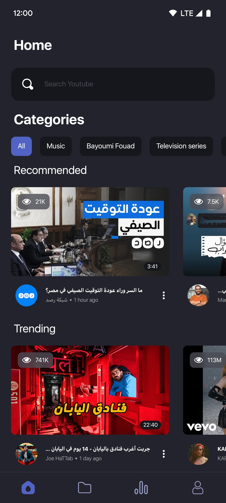
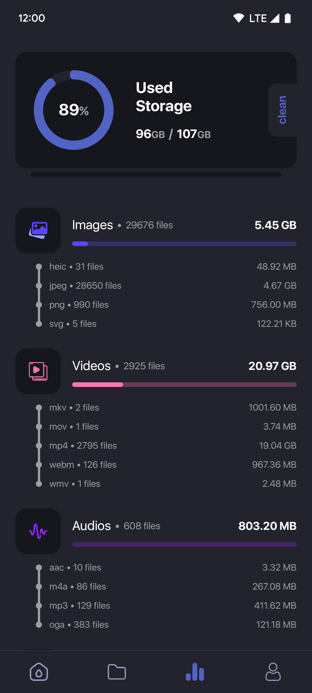
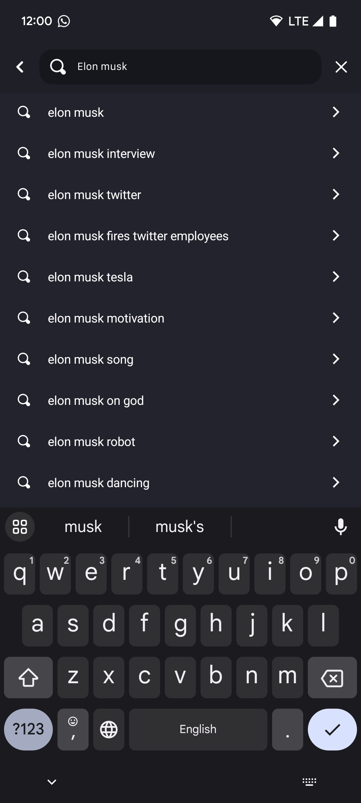
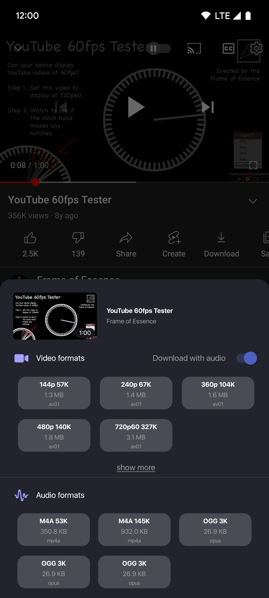
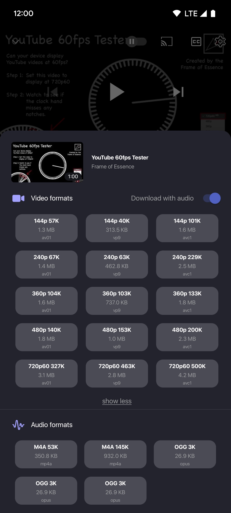

<!-- PROJECT Intro -->

  # Oria
  <a href="https://twitter.com/OriaApp">Twitter</a>
   

**Oria is a free Android app that downloads video and audio.** It provides video resolutions in a range of 144p, 720p, 1080p HD, 2K HD, 4K HD with/without 60 fps and audio formats in MP3, OGG, OPU, M4A and many more, With Oria, users can look for content on all their platforms without using numerous apps. It requires Android Android 5 (API level 21) until Android 13 (API level 33).

Oria comes with awesome features like:

- 🔐 Fast, Reliable and Secure
- 📱 Compatible with Android 5 and above
- 💾 Download media with, or without an account
- 🌠 Can download 4K and HDR videos
- 🖌️ Night mode
- 🌍 Almost support the most popular media formats
- 🕵️‍♂️ Fixable download options 
  - 🏙️ Download video only
  - 🎧 Download audio only
  - 🎬 Download video with audio
  - 💻 Select your media codec
- 🤯 Support 70+ media codec
- ✨ Built on a modern tech stack

This project was created to be the most powerful free android app video downloader for the public, so no wonder it's so feature-rich

(<a href="#top">back to top</a>)

## 📸 Screenshots

Here is a sneak peek of the application and it's visuals 😍:

<table>
  <tr>
    <td>
      
       
      
Home

    </td>
    <td>
      
       
      
Media explorer

    </td>
  </tr>

  <tr>
    <td>
      
       
      
Statistics

    </td>
    <td>
      
       
      
In app search

    </td>
  </tr>

   <tr>
    <td>
      
       
      
Format drawer

    </td>
    <td>
      
       
      
Expanded format drawer

    </td>
  </tr>

</table>

(<a href="#top">back to top</a>)

# 💾 Installation

Oria supports the following architectures

- 🛠 [armeabi-v7a](https://github.com/9init/Oria-App/releases/latest/download/app-armeabi-v7a-release.apk)
- 📦 [arm64-v8a](https://github.com/9init/Oria-App/releases/latest/download/app-arm64-v8a-release.apk)
- 🐳 [armeabi-v7a/arm64-v8a](https://github.com/9init/Oria-App/releases/latest/download/app-universal-release.apk)

  
(<a href="#top">back to top</a>)

  # [Download](https://github.com/9init/Oria-App/releases/latest/download/app-universal-release.apk)
   

# 🛣 Help Us

This project is far from perfect, and we'll reach there one day, or at least get close.
Currently it is platform specific, we are planning to support IOS devices in the future.
We need your help, please tell us any issue you have faced or any suggestion.

Have a look at the 🛣 [Roadmap](https://github.com/9init/Oria-App/issues) for a full list of proposed features and
enhancements.

(<a href="#top">back to top</a>)

# 🌟 Support this project

### [⏫⭐️ Scroll to the star button](#start-of-content)

If you believe this project has potential, feel free to **star this repo** just like many [amazing people](/stargazers)
have.

(<a href="#top">back to top</a>)

# ❗️ IMPORTANT
This tool is meant to be used to download CC0 licensed content, we do not support nor recommend using it for illegal activities.

(<a href="#top">back to top</a>)

